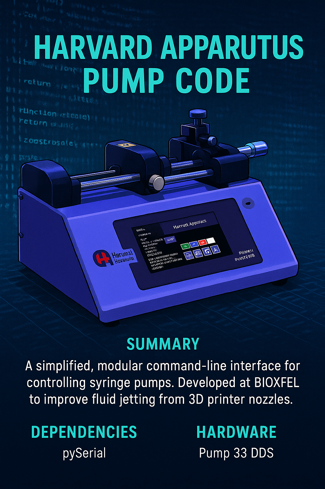

# Harvard Apparatus Pump 33 DDS Control




## 🚀 Overview
This project provides a **simplified, modular command-line interface** for controlling Harvard Apparatus syringe pumps using `pySerial`. Originally developed at **BIOXFEL**, this refactored code replaces a legacy, complex research script with a cleaner, more maintainable solution.

The program was designed to streamline experimental workflows involving precise fluid jetting from 3D printer nozzles. These studies aim to enhance control, accuracy, and efficiency in bio-physical processes—contributing to advancements like improved drug production and next-gen 3D printing technologies.

## 🧬 About BIOXFEL
BIOXFEL leverages ultra-powerful lasers and cameras to study biological processes at atomic resolution without damaging samples. This project supported research focused on controlling liquid jetting mechanisms, paving the way for precision fluidics in scientific and industrial applications.

## 📂 Features
- Modular and easy-to-read Python code.
- Command-line interface for streamlined lab workflows.
- Serial communication with Harvard Apparatus pumps.
- Compatible with **Pump 33 DDS** hardware.

## 📂 Harvard Manual
- link: https://www.harvardapparatus.com/media/manuals/Product%20Manuals/Pump-33-DDS-Manual-5419-013-REV1.pdf (make sure you find the version that aligns with your pump)

## ⚡ Dependencies
- `pySerial`  
Install via:
```bash
pip install pyserial

## 🖥️ Hardware

- **Device:** Harvard Apparatus Pump 33 DDS  
- **Connection:** Serial (RS-232 or USB-to-Serial adapter)

> **Note:** Ensure you're using the correct manual for your pump version.  
> This project references the following manual:  
> [Pump 33 DDS Manual (REV1)](https://www.harvardapparatus.com/media/manuals/Product%20Manuals/Pump-33-DDS-Manual-5419-013-REV1.pdf)

If your device behaves unexpectedly, verify the firmware version and cross-check it with the correct manual revision.

---

## 🛠️ Usage

1. Connect your pump to the computer via serial.
2. Configure the correct COM port in the script.
3. Run the program using:

```bash
python pump_controller.py --start
```

Follow the CLI prompts to integrate with your research workflow.

---

## ⚠️ Troubleshooting

### 🔹 Wrong Manual Issue
- If commands aren’t responding, **confirm that your hardware matches the referenced manual version**.
- Using the wrong manual caused confusion during development, so **double-check this early** to avoid issues.

### 🔹 Serial Connection Errors
- Ensure the **correct serial port** is selected in your configuration.
- Confirm that **USB-to-Serial adapter drivers** are properly installed on your system.

